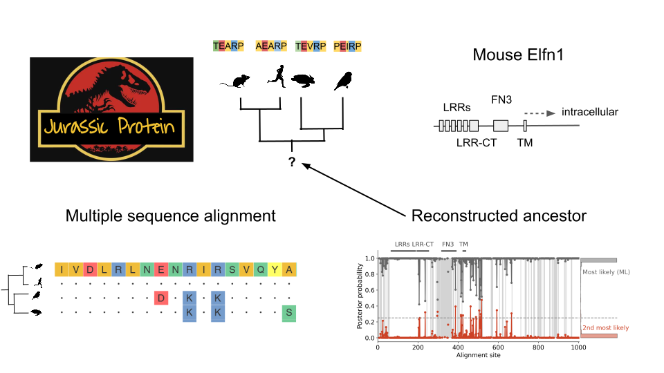

# Elfn1 reconstruction
Computationally reconstruct the ELFN1 protein from the last amniote ancestor. See the preprint for context:
[Cortical interneurons: fit for function and fit to function?](https://doi.org/10.1101/2023.02.23.529671). See the [interneuron_evolution repo](https://github.com/JoramKeijser/interneuron_evolution/) for the transcriptomic analyses from the paper. 




## Installation

Clone this repository:
```
git clone github.com/JoramKeijser/elfn1_reconstruction/
```
Recreate the conda environment to install the required Python and R packages/libraries. 
```
cd elfn1_reconstruction/
conda env create --name topiary --file environment.yml
conda activate topiary
```
Install the project:
```
pip install -e .
```

## Organization
The code is organized into the following folders:

- `scripts` contains scripts that implement the reconstruction pipeline, and analyse the result. 
- `src` contains the code that is shared by several scripts
- `figures` contains the figures shown in the manuscript. 
- `results` contains the files necessary to analyse the results and reproduce Figure 9 from the manuscript. In particular:
   - `extant_dataframe.csv`: sequences of extant species used to reconstruct ancestors. 
   - `anc54.fasta`: most likely (ML) and second most likely (altAll) Elfn1 sequence of the last common amniote ancestor. 
   - `anc54.csv`: per-site statistics (e.g. posterior probability) of reconstructed sequence.
   - `ancestors54_and_extant.fasta`: multiple sequence alignment of ML ancestor and key extant species (mouse, human, finch, turtle).

## Download data
Download four seed sequences 
```
bash scripts/download_sequences.sh
```
Use the seed sequences to find Elfn1 homologs, do reciprocal BLAST to call their orthology, lower dataset redundancy, and align the resulting sequences. 
This will take less than an hour on a laptop.
```
python scripts/create_seed_dataset.py
```
The results of this step will be in a folder called `seed_to_ali`. Specifically have a look at the `05_clean-aligned-dataframe.csv` and `06_alignment.fasta` files. The former is the input for the next step, the latter can be viewed in an alignment viewer. 

## Infer ancestral sequences
Use the aligned sequences to infer the ancestral proteins. This is a computationally heavy step because it relies on bootstrapping. I ran the following SLURM batch script on a computing cluster: 
```
sbatch scripts/alignment_to_ancestors.sh 
```
You can also run this step locally since it cannot be parallelized across multiple machines anyway:
```
topiary-alignment-to-ancestors seed_to_ali/05_clean-aligned-dataframe.csv --out_dir ali_to_anc 
```
The run time will depend on the number of cores and the (automatically determined) number of bootstrap replicates. Doing 600 replicates on 8 cores takes ca. 14 hours. The results will be in the `ali_to_anc/results` folder. 

## Determine branch support
The previous step estimated our confidence in the ancestral sequences. Finally, we determine our confidence in the evolutionary tree on which the reconstructed sequences are placed. This is again done using the bootstrap. The following SLURM script parallelizes the computation:
```
sbatch scripts/bootstrap_reconcile.sh 
```
The run time will depend on the parallelization scheme and the number of bootstrap replicates. Doing 600 replicates on 35 nodes took ca. 8 hours. The result will be added to `ali_to_anc/results`. 

## Acknowledgements 

We are grateful to the developers of the [Topiary package](https://topiary-asr.readthedocs.io/), a very convenient wrapper around different software packages that together make up the reconstruction pipeline. This repository would not have existed without it. Also see the [Topiary paper](https://doi.org/10.1002/pro.4551). 
